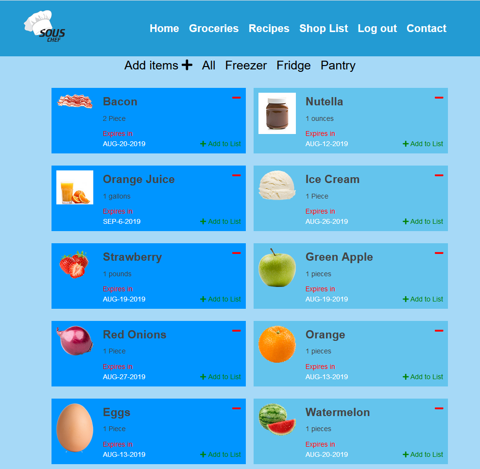
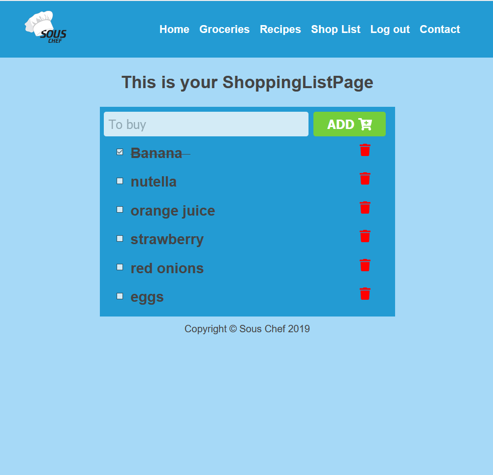

# Sous Chef App!

This is an app that tracks your grocery items, lets you create a shopping list and search recipes based on items that you already have in your kitchen!
## Demo

- [Live Demo](https://sous-chef.artanmuzhaqi.now.sh/)

## Screenshots
Landing Page:

Groceries Page:

Add Grocery Item Page:

Recipe Search Page:

Shopping List Page:

## Loging In

You can register for an account or use `test` and `Test123!` as username and password

## Set up

Complete the following steps to start a new project (NEW-PROJECT-NAME):

1. Clone this repository to your local machine `git clone https://github.com/muzhaqi16/sous-chef-client.git NEW-PROJECTS-NAME`
2. `cd` into the cloned repository
3. Make a fresh start of the git history for this project with `rm -rf .git && git init`
4. Install the node dependencies `npm install`
5. Move the example Environment file to `.env` that will be ignored by git and read by the express server `mv example.env .env`
6. Edit the contents of the `package.json` to use NEW-PROJECT-NAME instead of `"name": "sous-chef",

## Available Scripts

In the project directory, you can run:

### `npm start`

Runs the app in the development mode. 
Open [http://localhost:3000](http://localhost:3000) to view it in the browser.

The page will reload if you make edits. 

### `npm test`

Launches the test runner in the interactive watch mode. 

### `npm run build`

Builds the app for production to the `build` folder. 
It correctly bundles React in production mode and optimizes the build for the best performance.

The build is minified and the filenames include the hashes. 
Your app is ready to be deployed!
